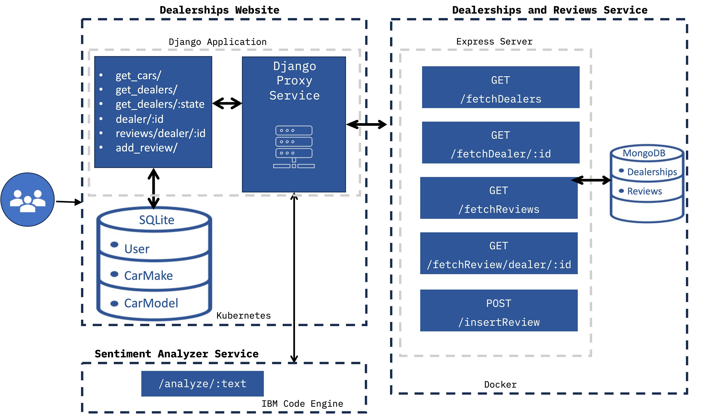

# Final Capstone Project: Full-Stack Web Application for Car Dealership Reviews

## Overview
This project was completed as part of the IBM Full Stack Cloud Developer Professional Certificate. The goal was to develop and deploy a cloud-based full-stack web application that allows users to interact with car dealership data. The application provided functionalities for viewing dealerships, submitting reviews, and analyzing customer sentiments, all while demonstrating proficiency in backend, frontend, and deployment technologies.

---

## Objectives
- Build a fully functional full-stack web application using Django, React, and Python.
- Implement user authentication and session management for secure access.
- Integrate backend services for managing car dealership data, user reviews, and sentiment analysis.
- Deploy the application on IBM Cloud using Docker and Kubernetes.
- Set up continuous integration and delivery pipelines using GitHub Actions.

---

## Project Breakdown

### Prework
- Created an IBM Cloud account and provisioned a Watson Natural Language Understanding (NLU) service to analyze customer review sentiments (positive, negative, neutral).

### Module 1: Static Web Pages with Django
- Developed static pages for the website, including "About" and "Contact" pages.
- Configured a Django app and deployed the static pages to IBM Cloud.

### Module 2: User Management with Django and React
- Implemented user authentication using Django’s built-in authentication system.
- Created a user registration and login system with React for the frontend.
- Debugged and resolved issues in the logout functionality, ensuring browser compatibility.

### Module 3: Backend Services and Database Integration
- **API Development**:
  - Built REST API endpoints using Django to fetch dealership and review data.
  - Filtered dealership data by state or ID using query parameters.
- **Database Models**:
  - Designed Django models for managing car makes, models, and reviews.
  - Adjusted database schema to match backend service requirements.
- **Sentiment Analysis**:
  - Deployed a Dockerized sentiment analyzer on IBM Cloud Code Engine.
  - Integrated the analyzer into backend services to provide sentiment scores for customer reviews.

### Module 4: Dynamic Pages with React
- Added dynamic React components for displaying dealership details and customer reviews.
- Developed a review submission page, enabling users to post feedback for specific dealerships.
- Synced backend API responses with React components to ensure seamless data rendering.

### Module 5: CI/CD and Application Deployment
- **Continuous Integration/Delivery**:
  - Configured GitHub Actions workflows to lint and validate Python and JavaScript code.
  - Used ESLint and Flake8 for automated code quality checks, fixing over 200 errors.
- **Containerization and Deployment**:
  - Built Docker images for the application and pushed them to a container registry.
  - Deployed the application on Kubernetes using a `deployment.yaml` file.
  - Verified the deployment and ensured scalability across cloud resources.

---

## Architecture
- **Backend**: Django for API development, data modeling, and backend services.
- **Frontend**: React for building dynamic user interfaces and managing interactions.
- **Database**: SQLite for user and car data storage.
- **Sentiment Analysis**: IBM Watson NLU integrated via a REST API for analyzing review sentiments.
- **Cloud Deployment**: Dockerized application deployed on Kubernetes using IBM Cloud.

---

## Features
1. **User Management**:
   - Secure user authentication with session handling.
   - User registration and login functionality with React and Django.
2. **Dealership Data**:
   - Dynamic dealer listings filtered by state or ID.
   - Integration with backend APIs to fetch dealership details and reviews.
3. **Review Submission**:
   - User interface for submitting reviews.
   - Sentiment analysis on submitted reviews using IBM Watson NLU.
4. **CI/CD Pipelines**:
   - Automated linting and testing using GitHub Actions.
5. **Deployment**:
   - Containerized application hosted on Kubernetes for scalability and reliability.

---

## Tools and Technologies
- **Programming Languages**: Python, JavaScript
- **Frontend**: React, HTML, CSS
- **Backend**: Django, REST APIs
- **Database**: SQLite
- **Cloud Services**: IBM Cloud, Watson NLU
- **Containerization**: Docker
- **Orchestration**: Kubernetes
- **CI/CD**: GitHub Actions

---

## Outcomes
This project demonstrated expertise in full-stack development, API integration, containerization, and cloud deployment. It combined backend and frontend development with scalable cloud technologies to deliver a functional and user-friendly application.
